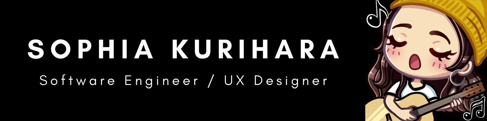

### Hello world, I'm Sophie! 👋

#### I am an Education Content Strategist currently in Product Education at [Figma](https://www.figma.com)
 
<!--
**sophiakurihara/sophiakurihara** is a ✨ _special_ ✨ repository because its `README.md` (this file) appears on your GitHub profile.

Here are some ideas to get you started:

- 👯 I’m looking to collaborate on ...
- 🤔 I’m looking for help with ...
- 💬 Ask me about ...
- 📫 How to reach me: ...
- 😄 Pronouns: ...
- ⚡ Fun fact: ...
-->
